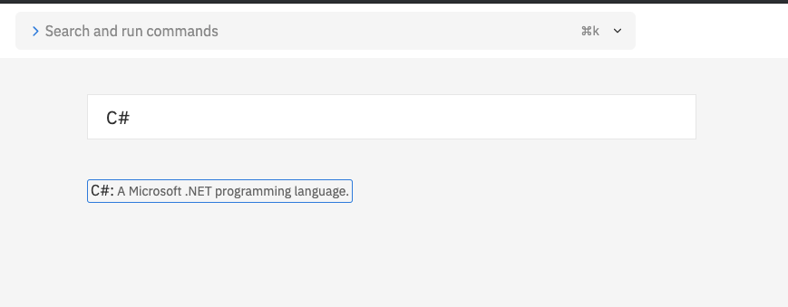
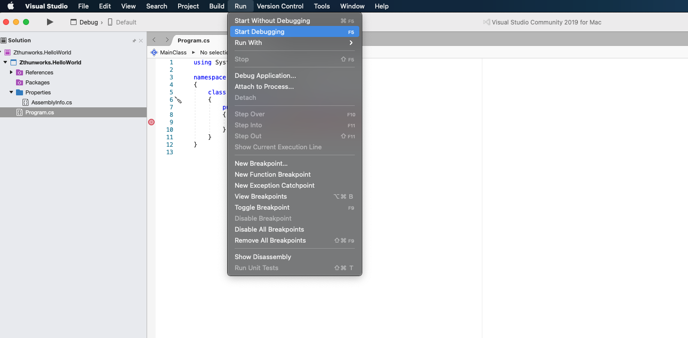

# Your First Console Application

In this chapter, we are going to be writing the "Hello World" application. This application, by far, serves no purpose at all and provides no real world application of how to do anything in programming. It has one main focus and one focus only.

> The purpose of Hello World in all languages is not to teach you anything overwhelmingly valuable about the language. **It serves to show you the skeleton you need of where the application enters and where it exits.** It also shows the basic technique to display output to the user.

## Setting Up With Visual Studio

For this tutorial, we are going to open up visual studio. If you've never opened this application before, it will look something similar to this:


Click **+New**. We need to find the Console application option.


At this point, you will be asked for the name of your project. You can title it whatever you want, but you will almost always want to use the following convention.

1. Use [pascal case](https://techterms.com/definition/pascalcase) when naming projects. Unless otherwise specified, this will be the default casing for Projects, Namespaces, Classes, Interfaces, and Methods.
2. Use the format (DomainName).(ProjectName).

> Using pascal case is the standard convention in C#. There is nothing stopping you from using other conventions here, but the overwhelming majority of developers and C# code out there is in pascal case. Also, using your domain, company, or online handle name as the domain name when you name your project just helps with naming conflicts. For example, if you worked at Google, and wanted to start a new C# project called TheNextBigThing, you will want to title the project Google.TheNextBigThing. This way, when Facebook comes around and wants to start a new C# project, also called TheNextBigThing, they would use Facebook.TheNextBigThing for their project. The naming conflict here is avoided. Legality is a different story and that's outside the scope of this chapter.

It may look similar to this.


Now click the _Create_ button and you should be on your way to seeing your first application. Your output should look like this.


## Setting Up With Replit

If you don't have Visual Studio and are using [Replit](https://repl.it/), then there are less steps. Once you log into the system, you will create a Repl with the C# language.



Once that is completed, you will give it a name similar to how you would in Visual Studio. The same rules apply.


Click the _Create repl_ button. You will be given the following screen.


## Dissecting The Initial Application

Now that we have our application with an initial C# source file, lets have a look at the parts and see what we have.

If you are using Replit, you may want to copy and paste the following snippet into the main.cs file

```cs
using System;

namespace Domain.HelloWorld
{
    class MainClass
    {
        public static void Main(string[] args)
        {
            Console.WriteLine("Hello World!");
        }
    }
}
```

Change **Domain** to whatever you decided to name your domain earlier.

> While the initial replit application will work, we are going to remove some of the noise with the differences so that you can see the full output that is standard across applications. From here on out, we will be using Visual Studio since that is going to be the majority use case for C# .Net.

If you have some experience with any other programming languages, some of this may look very familiar. If this is your first programming language, then we will break down this application for the absolute minimum template code file you need to create it.

### Using

At the top is a **using** statement. This goes to an advanced topic, but generally, this is how you import shared code from DLL files. Everything in .Net is DLL files scattered across your system and in NuGet packages, which we will discuss later. For now, what this tells us is to use the System **namespace** from the System .Net assembly. An assembly is just another name for some DLL in the .Net framework. It's nothing special. The System package gives us a lot of the basic foundational features of the .Net framework. This will be the most common assembly you will import.

> Pop Quiz: What's a DLL? Do you remember this from paying your DEBT?

To import code in different namespaces and assemblies, you simply add to the list of using statements.

```cs
using Zthunworks.Shared.Code.Is.Here;
```

### Namespace

Underneath the using statements is a **namespace** declaration. Namespaces are nothing more than ways to organize your code. They don't serve any other functional purpose. Think of them like folders on the file system. The rules of namespaces are as follows:

1. You can separate namespace paths using the dot, '.', operator.
1. Namespaces are alpha numeric and must start with an alpha character [A-Z] or [a-z].
1. Namespaces do not have to be unique.
1. While they don't have to be unique, it is heavily advised against to use a namespace that is owned by another domain.

> Declaring a namespace used by a domain that is not your own can cause conflicts with future versions of that domain. For example, if I add a piece of code call MyCode under Microsoft's **System** namespace, and and upgrade the .Net framework to the latest and greatest version includes a new feature called MyCode under the **System** namespace, you now have a hard conflict which is unresolved. By sticking to your Domain, you will avoid this situation and you can organize your code as you see fit.

To declare a namespace, just use the **namespace** keyword followed by a dot separated path.

```cs
namespace Zthunworks.My.New.Namespace
```

> Note that while it is possible to declare namespaces within namespaces, don't do it. It just makes your code harder to read and harder for others to maintain. It is better to just join the namespace names at the top of the file with the dot operator.

### Class

The entire .Net framework revolves around **classes** and **interfaces**. For now, you will think of a class as similar to a namespace but these would be the files on your file system. Classes describe _objects_ that are responsible for various functionality. Imagine for a second if we were writing an application for building a clock. You may have a **class** for the ClockMaker, which would be responsible for assembling the clock. You may a class for a ClockGear, which describes a single gear inside the clock, what it's responsibility is, as well as its physical attributes. You may have a class for a ClockHandle which describes the angle at which it is positioned. You can continue down the path of creating **classes** that represent single pieces of behavior and responsibility. When **classes** all come together and integrate with one another, we have a full application on our hands.

The **class** structure of a C# application is up to you and your creativity. There are many routes to take when designing this structure; the sky is the limit here. If this is confusing or unclear at this point, that's OK. We will go into great detail on **classes** and **interfaces** in a later chapter. For now, you will need to know that our entry point into our console application MUST live in some class. Whatever the name is or what it's responsible for, we aren't going to care at this point.

The structure of a class just uses the **class** keyword.

```cs
class MyClass
```

The rules of class names are as follows:

1. Classes names are alpha numeric and must start with an alpha character [A-Z]. You can start them with [a-z], but it is best practice to keep them pascal case.
1. Class names are unique within the same namespace.
1. Class names cannot have punctuation.

### Main Method

We are now at the heart of our application, called the **Main** method. Some people call this the **Main** function, but they mean the same thing. ALL C# applications that are executables will look for the following signature which is the entry point of the application.

```cs
public static void Main(string[] args)
```

When the executable file is ran on the command line, it will look for this method. You can have more than one main method, but it's generally best to just stick with one.

> If you have more than one main method, you have to actually tell the compiler which one to use. This means that the second Main method just becomes noise in your application and is never invoked. Having code that sits around doing nothing creates distractions for you and others during debugging. Clean your room!

### Code Blocks

Notice that the namespace, class, and main method are all following by a bracketing structure.

```cs
public static void Main(string[] args)
{
  ...
}
```

Those brackets describe what's called a _code block_. Code blocks separate code and organize the scope of the entity it wraps. You will use these for almost everything that sections off pieces of code. For example, it is possible to do the following:

```cs
public static void Main(string[] args)
{
  {
    Console.WriteLine("I'm in a code block");
  }
  {
    Console.WriteLine("I'm in another code block");
  }
  {
    Console.WriteLine("Why is this in an anonymous code block?");
  }
}
```

However, it is recommended to just use code blocks when they are required by the language and leave them out everywhere else.

> These anonymous code blocks serve no purpose other than to create noise and confuse other developers. It makes your code harder to read, raises its complexity, and you rarely see them in the wild. Just generate code blocks when they are required by the language and you won't run into any issues or confusion.

### Writing Output

Finally, we have the meat of the application, which is our hello world statement.

```cs
Console.WriteLine("Hello World");
```

We talked a little about this before, but Console is a class that represents the actual console that the application is running in. We are invoking a method on our Console object call WriteLine, which, from the description alone, is going to output "Hello World" to the console on a line.

Let's run our application and see the output. To actually run our application, we can just use the menu at the top.


And we get the following.


Notice in the terminal, we have effectively printed hello world to the console and successfully exited the application.

### Debugging

Before we conclude the lesson for today, you will want to know how the debugger works. This is an essential part of development and part of the DEBT you pay when learning a new technology. Let's take a look at our application. On line 9, we are going to add what's called a breakpoint into our application. To do this, you will click in the space to the left of the line number. If you do properly set a breakpoint, you will see a small red dot.


What we did earlier was run the application. Now, instead of selecting _Start Without Debugging_, we will click _Start Debugging_.



Unlike before, where our application quickly started and then immediately exited, we actually get halted on the line where our breakpoint was set.


Notice the little arrow on the side. This is where the execution of your application is halted. We now have a multitude of tools available to us that allow us to look at our application, but for the sake of this process, we only need to concern ourselves with the buttons at the top. Depending on the UI you are using, these will generally be in different locations for different operating systems and different tools; however, then will generally always mean the same thing across languages.


From left to right we have.

<dl>
  <dt>Stop</dt>
  <dd>Stops the execution of the debug session.  Force quits the application at that point.</dd>
  <dt>Some extra information</dt>
  <dd>Just some debug general info.  Meant to separate the stop button so you don't click it by accident</dd>
  <dt>Continue</dt>
  <dd>Continues the program execution until the next breakpoint</dd>
  <dt>Step Over</dt>
  <dd>Executes the current line and breaks on the next line</dd>
  <dt>Step In</dt>
  <dd>Steps into the method that the program is currently halted on.</dd>
  <dt>Step Out</dt>
  <dd>Steps out of the method that the program is currently halted on.</dd>
</dl>

We will get more into **Step In** and **Step Out** in later chapters. The majority of the time, you will be using **Step Over** and **Continue**. Rather than just describing what they do and what they look like, the best thing to do is to give it a whirl and try out the different buttons to see how they behave.

> This will be one of the more important skills when doing C# development. Whenever you have an issue with your application, unless you are an absolute master of spotting details and finding needles in haystacks with just your eyes, the debugger will be your best friend. It's just massively faster to just run the debugger and see what is actually happening rather than trying to figure it out by just looking through piles of code. Slowing down the execution also helps you learn an application which may be unfamiliar to you. Never listen to anyone who tells you that the debugger doesn't matter. Chances are, they've never done development in their life, or they're just terrible programmers and make other developers lives harder. Debuggers are there for a reason. Use them.
