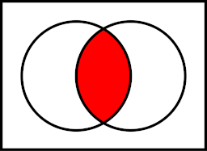
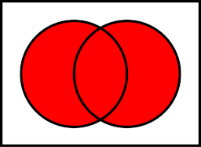

# Intro to Logic

When you hear the phrase, logical thinking, what comes to mind? A lot of folks may think of Spock from Star Trek; the
Vulcans thrived on logical deduction and threw away all their emotions.

When we talk about logic in the sense of programming, we don't think about it in terms of arguments, proofs, debates, or
other such activities. In programming, when we talk about using logical expressions, we are mostly talking about using
what is called [boolean algebra](https://en.wikipedia.org/wiki/Boolean_algebra); this form of mathematics was introduced
by George Boole in his first book
[_The Mathematical Analysis of Logic_](https://www.cambridge.org/core/books/mathematical-analysis-of-logic/BF7CDDC37F3F4FC698CEEE5F2FA0270C#).

When we talk about boolean logic, we mostly focus on three different types of operators. Operators are how we relate
mathematical expressions and the truthfulness of each result. There are 4 possible operators.

1. NOT ([Negation](https://en.wikipedia.org/wiki/Negation))
2. AND ([Conjunction](https://en.wikipedia.org/wiki/Logical_conjunction))
3. OR ([Disjunction](https://en.wikipedia.org/wiki/Logical_disjunction))

However, in order to fully understand how to use these logical operators, we must first grasp what represents true and
false in the engineering sense.

## Representation of Truth

Pop quiz.

<hr>
<details>
<summary>What is a bit?</summary>

It's a binary digit that can have at most 2 possible values.

</details>
<details>
  <summary>What are the possible values of a bit?</summary>

A bit can be a 1 or a 0.

</details>
<hr>

Understand that when we discuss the truthfulness of a bit, **1** represents **TRUE** and **0** represents **FALSE**.
This is universally true across all programming languages. Any language which does not adhere to this standard is doomed
to failure from the start or will eventually be overtaken by another language that is more standardized and follows this
convention.

> The main reason this is here is because not all languages define boolean types. For example, in the C language, you
> have to use 1 for true and 0 for false, while in the C++, there is explicit types for true and false called bool.
> Engineering at the device level, where electricity is used, must also have switches for on and off and these are
> generally represented by 1 and 0 respectively stored in some register on your chip.

When you start learning languages like JavaScript or TypeScript, they introduce the concept of truthy and falsy. When
you hear the term truthy instead of true, it simply means that if _I convert this thing to represent a boolean, it
outputs true_. Likewise, when you hear the term falsy, it means if _I convert this thing to represent a boolean, it
outputs false_. Another way to think of it is that this expression is kinda true or kinda false. Some examples would be
represented in the following table.

| Thing   | Type   | As Boolean |
| ------- | ------ | ---------- |
| True    | Bool   | True       |
| False   | Bool   | False      |
| 0       | Bit    | False      |
| 1       | Bit    | True       |
| 123     | Number | True       |
| "I ran" | String | True       |
| ""      | String | False      |

The examples above are mostly by convention. It is generally accepted that for numbers, only **0** is falsy, while all
other numbers are truthy. The empty string is falsy, while any string with characters in it, including white space, are
truthy.

> You don't have to memorize everything that is true and false and which values map to what. Most languages do this
> implicitly because your number system will be in base 10 while writing code and you will often have to do checks on
> values. The main takeaway here is that there are multiple representations of true and false and the conversion to the
> explicit value of true or false determines if it is considered truthy or falsy respectively.

Remember that when we start evaluating logical expressions, we are determining whether the end result is true or false
and those expressions clauses can be truthy or falsy. For the remainder of this chapter, we will use **1** as true and
**0** as false.

## Negation

The negation operator, or _NOT_ for short, is the easiest to understand. This is a _unary_ operator in that it only acts
on a single expression. To find the negation of an expression, take the final truthy value of the expression and reverse
it.

| A   | NOT |
| --- | --- |
| 1   | 0   |
| 0   | 1   |

## Logical Conjunctions



The logical conjunction operator, _And_ for short, deals with an all or nothing approach to truth. It is a binary
operator that compares two or more expressions. In the scope of a conjunction truth, **_every element in the expression
list must be truthy to evaluate to true_**.

The following table describes the mathematical truth for joining two expressions and the final evaluation of running
them through a conjunction operator in boolean logic.

| A   | B   | And |
| --- | --- | --- |
| 1   | 1   | 1   |
| 1   | 0   | 0   |
| 0   | 1   | 0   |
| 0   | 0   | 0   |

You can think of _And_ as the intersection portion of a [Venn Diagram](https://en.wikipedia.org/wiki/Venn_diagram).

Some examples are as follows.

```txt
1 AND 1 AND 1 AND 0 AND 1 AND 1 AND 1 = 0
```

```txt
1 AND 1 AND 1 = 1
```

```txt
0 AND ... = 0
```

## Logical Disjunction



The logical disjunction operator, _Or_ for short, deals with a one or none approach to truth. It is another binary
operator that compares two or more expressions. In the scope of a disjunction truth, **_at least one element in the
expression list must be truthy in order to evaluate to true_**.

The following table describes the mathematical truth for joining two expressions and the final evaluation of running
them through a disjunction operator in boolean logic.

| A   | B   | Or  |
| --- | --- | --- |
| 1   | 1   | 1   |
| 1   | 0   | 1   |
| 0   | 1   | 1   |
| 0   | 0   | 0   |

Unlike _And_, _Or_ is the union of a [Venn Diagram](https://en.wikipedia.org/wiki/Venn_diagram).

Examples:

```txt
0 OR 0 OR 1 OR 0 OR 1 = 1
```

```txt
0 OR 0 OR 0 = 0
```

```txt
1 OR ... = 1
```

Something interesting to notice is the idea that you can short circuit conjunction and disjunction expressions as soon
as you see a 0 or a 1 respectively. The moment you find a falsy value in a conjunction expression list, it will
automatically evaluate to 0. Likewise, the moment you find a truthy value in a disjunction expression list, it will
automatically evaluate to 1.

> This is actually by nature of how the conjunction and disjunction works. Think of PEMDAS in mathematics. If we had the
> following expression: 0 x (...), it wouldn't matter what the expression was inside the parenthesis. You can just
> automatically evaluate the result to 0.

## The Order of Logical Expressions

You may be wondering what the evaluation of the following expression is.

```txt
1 OR 0 AND 0
```

If we evaluated AND at a higher priority than OR, then this expression would evaluate as follows

```txt
1 OR (0 AND 0) = 1 OR 0 = 1
```

If we evaluated OR at a higher priority than AND, then this expression gets evaluated differently

```txt
(1 OR 0) AND 0 = 1 AND 0 = 0
```

So which is it? Well, like PEMDAS in mathematics, it depends on which generation you grew up in and whose opinion you
ask. The general academic order of operations is as follows:

1. P (Parenthesis)
2. N (Not)
3. A (And)
4. O (Or)

The pronunciation, _PuhNow_, doesn't exactly roll off the tongue very well, but that order of operations is generally
accepted in most languages. For the general public and how properly structure expressions, simply don't do this. Always
put parenthesis around same operator expressions that you want evaluated first and you will get it right every time.

> If you asked for a direct citation of where the order of operations in logical operators comes from, you'll be hard
> pressed to find it. Not all languages are created in the same manner and some handle the order differently. This
> [Wikipedia](https://en.wikipedia.org/wiki/Order_of_operations#Programming_languages) describes the general consensus,
> but there is no official PEMDAS like structure given for this ordering. While it may be fun to watch people on
> Facebook go ape crazy arguing about what the solution is to a poorly formatted equation, the best solution is to just
> make it explicit on what needs to be evaluated first if you have to switch the operator.
