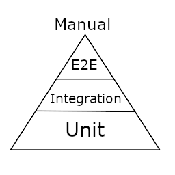

# Paying DEBT and Staying DRY

If you've been following along with the rest of the **Getting Started** course, you now know to start with why, you know how bits and bytes are represented in your processor, and you have a bare bones basic understanding of logical expressions. Before you move on into actual programming, there are two big concepts to be aware of that will help you in your journey of developing application.

## DEBT

You may not have heard the phrase, "pay your debt of learning a new language or technology." The phrase was created by [Anthony Bonta](https://github.com/zthun) and it deals with the initial steps when learning a new language. Like most journeys, the first question you have to answer is why. Why do I want to learn this new technology? It could be to advance your career, because your boss requires it ([bad reason](./01-01-ask-yourself-why)), because you want to become familiar with technology for fun, or maybe you have the next major startup idea to make the world a better place. Whatever your why is, we are moving to the next step of the how. How are we going to approach learning this new thing and a good way to do that is to fill out a DEBT table. So what exactly is the DEBT of learning a new language or technology.

### Deployment

The D in DEBT stands for deployment. How are you going to get this "thing" that your building out to users. Are you planning on having them look at a website? Is it a desktop application that they download an installer for? Is it something that your users can physically hold and interact with? Is it a phone or tablet application that lives in the respective app store? This is the _vision_ of what you're building. If you had a magic wand and could instantly jump to the end game, what does it look like to you?

> This is arguable the most important part of DEBT to pay. If you can't get whatever you're building to your users, nobody will use it and it may just become another lost project that never got off the ground. This, in of itself, becomes your ultimate goal. Even if you're building something just for yourself and nobody else, you still want to approach this part of DEBT just to keep your vision clear and your goals in line. If you don't have any goals, there is a higher chance of just abandoning your project before it reaches any light of day.

Many times, in organizations, this will be decided for you before you even join the team. Usually, you will be working towards a goal placed by the high executives on what direction the company is attempting to move towards. However, if you are working on a personal project, you absolutely want to think of this first to get a good sense of the path to take.

### Environment

The E in DEBT stands for environment. What tools do you need to be successful? For example, are you going to work on linux in a basic text editor with nothing else. Or are you planning to work on windows developing a C# application using Visual Studio, NuGet, and Azure. You'll often find that this is the easiest question to answer since many of your projects will have a lot of overlap here and you may use the same tools over and over again.

This is a gathering stage and often, you will have influence over what tools you need to be successful as there are many tools that can do the same job. This section is much more flexible than most since a lot of the tools you require come down to personal preference.

> It is a very good idea to work with various tools to get experience with them, but it is OK to have a favorite. Generally, allowing the masses to use their favorite tools to get the job done often leads to higher productivity since they aren't going to have to struggle with the tools that they aren't familiar with or don't like.

### Build and Debug

The B in DEBT stands for build and debug. Chances are, your first revision of whatever your doing won't be a perfect masterpiece and you will need to go back and perform some kind of maintenance to fix issues and make it better. This answers the question of how to build what your building. When your working with programming languages, often times, this will be what compiler your are using. For example, the following table describes the names of the compilers and tools used to build and assemble common languages.

| Language   | Compiler Tools                                                                                                                                                                                     |
| ---------- | -------------------------------------------------------------------------------------------------------------------------------------------------------------------------------------------------- |
| C          | [gcc](https://gcc.gnu.org/), [make](https://www.gnu.org/software/make/)                                                                                                                            |
| C++        | [g++](https://gcc.gnu.org/), [make](https://www.gnu.org/software/make/)                                                                                                                            |
| C#         | [msbuild](https://docs.microsoft.com/en-us/visualstudio/msbuild/msbuild?view=vs-2019)                                                                                                              |
| Java       | [javac](https://docs.oracle.com/javase/7/docs/technotes/tools/windows/javac.html), [maven](https://maven.apache.org/), [gradle](https://gradle.org/), [ant](https://ant.apache.org/)               |
| TypeScript | [tsc](https://www.typescriptlang.org/docs/handbook/compiler-options.html), [yarn](https://yarnpkg.com/), [npm](https://www.npmjs.com/), [gulp](https://gulpjs.com/), [grunt](https://gruntjs.com/) |

You will almost always want the command line name of the compiler you're using.

> Even if it doesn't pertain to how you build as a developer, it's a good thing to know the final underlying tool you're using so that later on you can automate things. Using the command line rather than a GUI is going to become a staple of language development, especially in the modern day because a lot of automated build software uses containerization and jails to run builds. These jails, which are just software isolation, do not have GUIs attached to them, so you are left with the underlying base tools for building your application.

It can be fairly easy to identify what tools are being used to build your software by doing a simple google search. You'll find a lot of references to each tool and how to use them on the command line. However, the more important piece here is how to _debug_ your application. It's inevitable. Your software and creation will most likely not be perfect and you will have to go back through and step through your implementation. It's amazing how many developers you will meet that will refuse to use any form of debugger or have no idea what a debugger is. By choosing to become an expert in the debugger of your chosen technology, you will be a step up at squashing bugs and fast response times. The following are common debuggers for different languages.

| Language   | Debugger                                                                                                                                                                           |
| ---------- | ---------------------------------------------------------------------------------------------------------------------------------------------------------------------------------- |
| C          | [gdb](https://www.gnu.org/software/gdb/), [Visual Studio](https://visualstudio.microsoft.com/)                                                                                     |
| C++        | [gdb](https://www.gnu.org/software/gdb/), [Visual Studio](https://visualstudio.microsoft.com/)                                                                                     |
| C#         | [Visual Studio](https://visualstudio.microsoft.com/)                                                                                                                               |
| Java       | [Eclipse](https://www.eclipse.org/downloads/), [NetBeans](https://netbeans.apache.org/), [IntelliJ](https://www.jetbrains.com/idea/)                                               |
| TypeScript | [Google Chrome](https://www.google.com/chrome/), [Firefox](https://www.mozilla.org/en-US/firefox/), [Visual Studio Code](https://code.visualstudio.com/), [Atom](https://atom.io/) |

Notice that the debugger tools often overlap with the environment tools. A good integrated development environment will often have a debugger with it. It is highly recommended to become very familiar with the debugger of the tool you've chosen.

> Another big reason to know you're debugger is that it also acts as a learning tool. If you are brand new to a piece of software, but doing step by step debugging, you can interactively see what is happening on each line of your code base. If you are unsure of where things are happening in an application, simply run the debugger and run though the steps to get to the point your at. Sometimes the bazooka approach is the fastest and most efficient way for knowing what is actually happening.

### Testing

Last, but definitely not least, is the T in DEBT. It stands for testing, and how you will be assuring that what you produce is of high quality. You may be familiar with the quality triangle. Faster, cheaper, or better, pick two. If you choose quality, you will have to have more resources or develop it at a much slower pace than you would like. If you choose fast and cheap, then your quality will suffer. If you have gone the fast and cheap route, then this portion of DEBT will not apply to you, but do be aware that you may be sacrificing the quality to move at a very rapid, unreasonable pace. If, on the other hand, you decide that quality is very important to you, you are going to have to have some form of testing in order to verify that what you build meets those standards.

In order to do this, you must decide not only what to test, but how you are going to test?

The above testing pyramid describes the general levels of testing that are often found in the industry. Everything inside the pyramid is a level of _testing automation_. What level you choose to test at is mostly going to be up to you and your organization. How deep you are going to go depends on your needs and the needs of the product you're building. At the least, you will want some form of manual testing.

#### Unit Testing

This form of testing is not only for quality, but is mostly for developers. At this level, individual units of behavior are tested throughout the code, and there is no outside requirements or resources needed. It is mostly used for refactoring, team coordination, debug access, and code cleanup. It is a form of a quality gate, but it should not be your only form as this level of testing is primarily targeted at developers to keep their code fresh, clean, and maintainable.

> Sometimes you'll see management dictating that this must be done and that you will also be mandated to provide the code coverage to how much you've tested. While this is annoying, and it displays a lack of understanding of what this is truly for, you don't have to balk at it or fight it very much. Once you mature as a developer, you'll find that you actually want to write unit tests regardless of being asked for it or not. It simply becomes a part of the task you are working on and, if you plan on becoming a rock star developer, will be something you provide out of box without even having to be asked.

The following are some unit testing frameworks that you can use for different languages.

| Language   | Frameworks                                                                                                                                                  |
| ---------- | ----------------------------------------------------------------------------------------------------------------------------------------------------------- |
| C#         | [NUnit](https://nunit.org/), [XUnit](https://xunit.net/)                                                                                                    |
| Java       | [Junit](https://junit.org/)                                                                                                                                 |
| TypeScript | [Karma](https://karma-runner.github.io/latest/index.html) + [Jasmine](https://jasmine.github.io/)/[Mocha](https://mochajs.org/), [Jest](https://jestjs.io/) |

#### Integration Testing

Integration testing is similar process to unit testing, and the task is generally shared between both developers and dedicated QA. Sometimes it moves more in one direction than the other. This form of testing actual is similar to unit testing, but it uses real outside resources such as databases and file systems rather than mocking out those layers.

> If you're a developer, you will want to work closely with QA engineers on this level of testing to make sure that you can run these tests yourself. This way, you will have a deeper understanding of the big picture of what is being developed and how it all integrates. By having a big picture mentality, you will more than likely be more engaged in what is being written.

When choosing to write integration tests, you will normally just use the same framework that you use for writing unit tests as this form of testing is performed in the same manner.

#### E2E Testing

E2E testing stands for _end to end_ testing and it is the level below a human opening your application and "clicking all the things." You can think of this layer as a developer who is creating a robot that mimics a QA person. They are actually opening your application, clicking buttons, providing input, and checking the output in an automated fashion. It's a full test that represents how an actual end user is going to be using your product. This is often owned by dedicated QA automation engineers.

> The main reason to invest in this is cost. Generally, it is much cheaper to invest in writing end to end testing and paying a larger cost up front to have the ability to do a full application test by clicking a button and getting back a report of what is working and what is broken. These are generally very valuable in freeing up time from manual testing which can be lengthy and very expensive.

The following are some e2e testing frameworks for various application types. Note that e2e testing is not often dictated by the language, but instead by the type of product being developed.

| Framework                                                                                                       | Used For |
| --------------------------------------------------------------------------------------------------------------- | -------- |
| [Selenium](https://www.selenium.dev/)                                                                           | Web Apps |
| [Protractor](https://www.protractortest.org/#/)                                                                 | Web Apps |
| [Coded UI](https://docs.microsoft.com/en-us/visualstudio/test/use-ui-automation-to-test-your-code?view=vs-2019) | Desktop  |

#### Manual Testing

This is what the industry has done for many years before automation became a thing. This is one or more dedicated people sitting behind the desk using the software against many test cases that must pass before a release.

Once you choose how deep you want to go down the pyramid, you will need to decide on the frameworks and tools to use when doing testing.

## DRY

DRY stands for Don't Repeat Yourself and it is a common phrase used in software development. This is going to be one of the most important concepts you will learn, so as you are learning new technologies on your journey, always keep this principle in the back of your mind. The principle of DRY comes in handle when dealing with code reuse. Throughout your career, you will often find the developer who is the copy/paste ninja. They are very good at finding solutions online, copying that solution, and then pasting said solution to get whatever problem they are working on solved. While they may get the job done, doing this will eventually cause a maintenance problem.

> Following the principles of DRY will make you into a programmer that can be very well respected. Your code will be easier to follow, have less bugs, and most importantly, the next person to modify it will have less of a hard time trying to make updates.

A good example of this is in the everyday excel spreadsheet. Think for a second if you have a cell that takes the sum of 20 other cells. Then you need a cell that averages those 20 other cells. Do you:

1. Repeat the references to the cells to get the sum and then divide by the total number?
2. Take the result from the sum cell and just divide by the total number.

While going the route of #1 would work, you will essentially be duplicating effort when the solution is going to be more elegant with #2. Always think of how you can reuse tested and known solutions and build on top of what has already been built. You don't have to reinvent the wheel every time.

## Recommendations

At this point, you are ready to dive into the technology of your choice. Before you start, I would recommend you create an account at [Github](https://github.com). Just about all of the courses will be using [Git](https://git-scm.com/) as well for source control so it is recommended to install that as well.

> Github is influential for experienced and new developers. It is one of the main source hubs on the internet for open source projects and is a fantastic place to engage the community and learn new things. If you aren't interested in starting your own projects, there are a lot of projects that you can dive deep into and contribute to.
