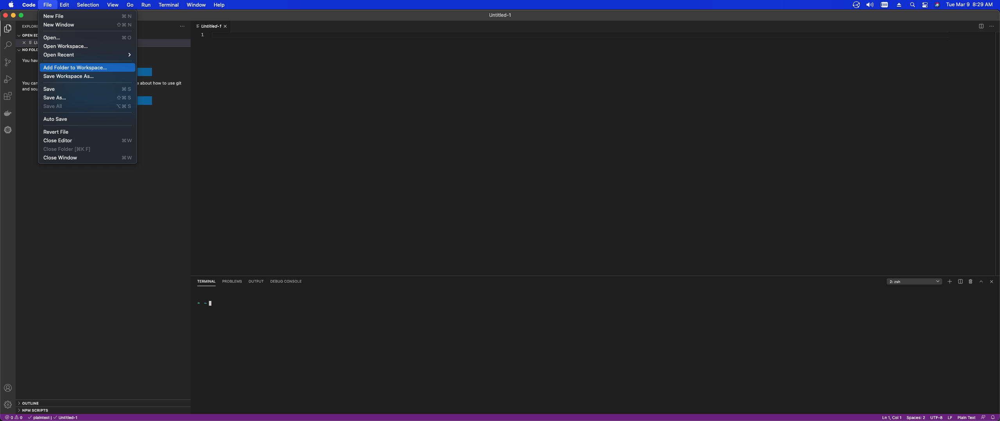
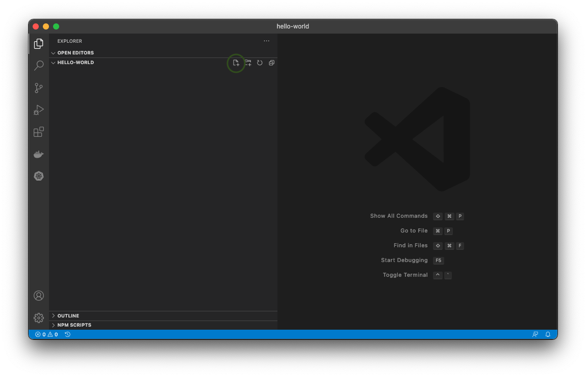
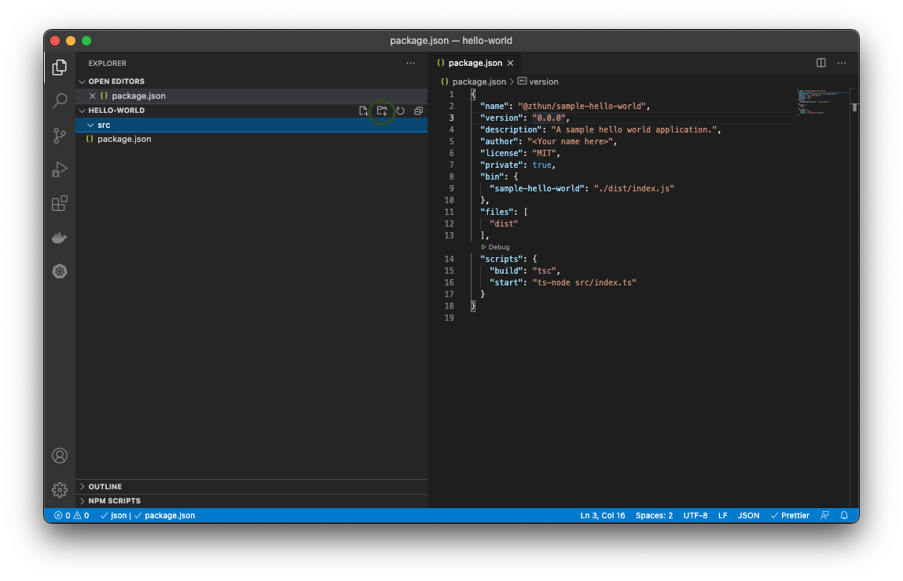
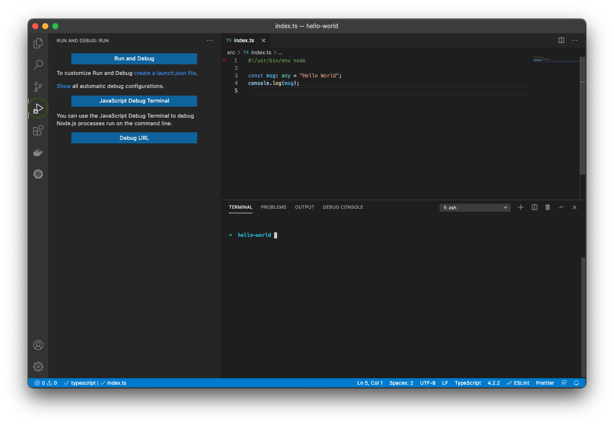
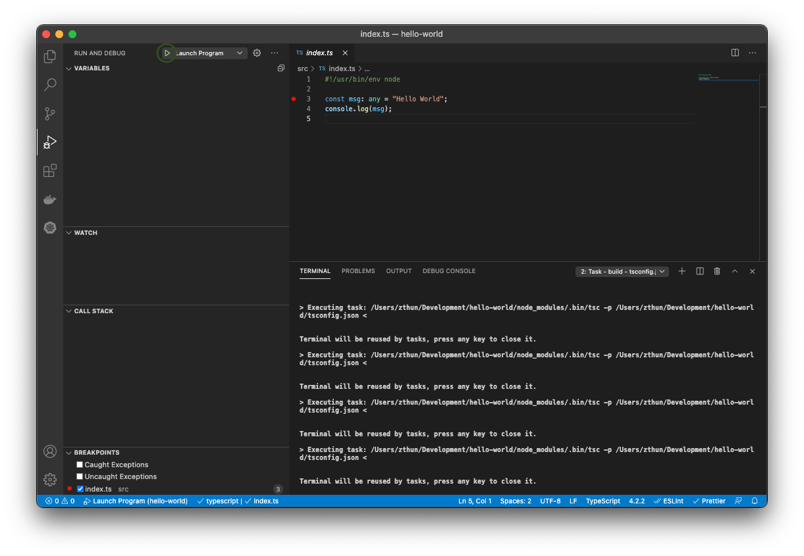

# Your First Application

In this chapter, we are going to be writing the "Hello World" application. This application, by far, serves no purpose
at all and provides no real world application of how to do anything in programming. It has one main focus and one focus
only.

> The purpose of Hello World in all languages is not to teach you anything overwhelmingly valuable about the language.
> **It serves to show you the skeleton you need of where the application enters and where it exits.** It also shows the
> basic technique to display output to the user.

## Setting Up

For the remainder of the tutorial, we are going to use [Visual Studio Code](https://code.visualstudio.com/) as our IDE
and [NPM](https://nodejs.org). If you are using another IDE editor, such as Atom, you will need to install the given
plugins for TypeScript development. If you are using Replit or some other ODE, you should be good to go out of box.

We're going to start out by creating a directory for our project. You can do this in Explorer or Finder. For those that
want to get their feet wet in the command line if you aren't familiar with it, then do the following:

1. Open Visual Studio Code
1. Click Terminal -> New Terminal

This will open up a new terminal window inside the IDE. Then type the following command.

```sh
mkdir hello-world
# OSX/Linux
ls
# Windows
dir
cd hello-world
```

If you aren't familiar with the command line and this is your first venture with it, the following table describes what
was just done.

| Command      | Description                                                          |
| ------------ | -------------------------------------------------------------------- |
| mkdir [name] | Creates a new directory.                                             |
| ls/dir       | List the contents of the directory you're in.                        |
| cd [name]    | Change the current working directory to the directory you just made. |

Now you can just add that folder to Visual Studio Code.



Click on the small _New File_ icon and name your file **package.json**.



Add the following contents to it:

```json
{
  "name": "@scope/sample-hello-world",
  "version": "0.0.0",
  "description": "A sample hello world application.",
  "author": "<Your name here>",
  "license": "MIT",
  "private": true,
  "bin": {
    "sample-hello-world": "./dist/index.js"
  },
  "files": ["dist"],
  "scripts": {
    "build": "tsc",
    "start": "node ./src/index.js"
  }
}
```

> This is your package file. A package file is what describes a JavaScript based application. It is the core source of
> all your dependencies and package metadata. When you begin publishing your own packages, websites, cli, servers, and
> applications, you will want each of them to have a package.json to let people know about who wrote the package, what
> the dependencies are, and the metadata for where to start your application.

Now click the small _Add Folder_ button and name it **src**.



> You can name your folder whatever you want, but it's very convenient to keep your source code separate from your
> output. This way, you can focus in on your coding in one spot rather than having it splattered all over the project
> folder. Most developers use src as the name and you will see this standard across source repositories on Github.

Now under the source folder, create a new file called **index.js**. Add the following contents to it:

```js
#!/usr/bin/env node

console.log('Hello World');
```

Once that is finished, open up a terminal, or use the one you may already have opened. Navigate to the hello-world
directory and type the following:

```sh
npm start
```

You should see the text, hello-world printed to the screen. Congratulations. You have just wrote your first JavaScript
node application from scratch (or maybe it's your 500th time writing this.).

## What, Exactly, Did We Do

What we wrote was the absolute minimum possible to run a node application. This application has no tests, no build, no
deployment, no functions, and no complex behaviors. In truth, we didn't even write a TypeScript application. We wrote a
JavaScript application that required absolutely no transpilation. In a sense, this is one beauty of JavaScript. For fast
scripts and very small tiny applications, JavaScript is fantastic. It's quick to start, gives an incredibly fast
feedback loop, and coders can just focus on coding rather than complicated build processes.

Let's start with the **package.json** file and look at what is actually inside there. For all modern day JavaScript and
TypeScript applications, the application itself always starts with package.json. You will live, eat, and breathe these
files so it's best to get to know what is in these things to start with.

```json
{
  "name": "@scope/sample-hello-world",
  "version": "0.0.0",
  "description": "A sample hello world application.",
  "author": "<Your name here>",
  "license": "MIT"
}
```

The above section of the file is mostly just metadata about your application. It helps describe who wrote the
application, what is the name of the application, what is the version of the application.

The name is divided into two sections, the @scope and the actual name of the package. The @scope of the package helps
with naming conflicts, so it's good to include one so you don't have issues later on. What you are allowed to

The version must follow a [SEMVAR](https://semver.org/) versioning scheme.

A quick summary of SEMVAR is as follows:

- The format for the version is (Major).(Minor).(Patch)-(Prerelease).
- Major versions can have breaking changes.
- Minor versions can have new features not found in the previous version.
- Patch versions are for bug fixes but no other changes.
- Prerelease can be a non-number and is mostly used for testing purposes before a release.

Note that your application is not **forced** to follow SEMVAR but for a valid package, you must have this format. The
meaning of Major, Minor, Patch, and Prerelease are up to your organization and your own structure. Make sure to document
if you don't follow this standard.

> Unpopular opinion here. It's OK if you choose not to fully follow SEMVAR. SEMVAR is not supposed to be the be all end
> all process for versioning. While it is followed by NPM and most packages, if it does not fit your organization's
> versioning strategy, then it doesn't fit. The maintainability and confusion this will cause is not worth the headache
> you will face trying to force it.

We'll come back to the **bin** and **files** field later, but the next part of the package is much more interesting.

```json
{
  "scripts": {
    "build": "tsc",
    "start": "node ./src/index.js"
  }
}
```

We don't need to worry about _build_ right now, but let's take a look at what we did.

```sh
npm start
```

Notice that **start** has an equatable key under scripts. When you use _npm start_, it will look for a _start_ key under
your package.json and will execute the script value that it holds. In this case, it runs node and points it to your
index.js file. You could have ran the application by just running the following command and you would have gotten the
same output.

```sh
node ./src/index.js
```

The takeaway here is the following.

1. We can write basic JavaScript without any transpilation and let it run directly through node.
1. The **package.json** file is the entry point into your application, not any single JavaScript file.
1. An external application, npm in this case, is used as the runner.

You will live, eat, and breath the package.json file during any kind of JavaScript and TypeScript project.

## What About the Actual JavaScript file

Notice that the actual JavaScript file we wrote is simply two lines.

```js
#!/usr/bin/env node

console.log('Hello World');
```

That first line is know as a pragma. You will normally not ever use it throughout all of your applications and is really
only used for invoking your application on the command line. If you are expecting to write a tool that is installed on a
system and have the user run command on the terminal, you will need to include this line in your main entry file. **It
only needs to be included once**. You don't have to memorize this. Just copy and paste it at the top of your file that
you intend to run and you should be good to go.

> This is mostly a requirement by operating systems. It just specifies how to run this application because remember, we
> can't just give a text file to our processor and have it be understood and ran. This line gives extra information in
> order for the file to be executed properly.

The next line is the console.log call. This outputs some text to the console and is one of many ways to get output to a
user. For the sake of simplicity, our output for this course will almost exclusively use the console. Nothing is too
interesting here. Just log 'Hello World' to the console and the script is finished. For now, this will be all we need.

## I Thought This Was a TypeScript Course

What about TypeScript? How is it different. Guess what, that's our next step. We will convert this little hello-world
application into a TypeScript application. Sorry to ruin the surprise and mystery, but to make a JavaScript file a
TypeScript file, we can simply change the file extension. **Rename the index.js file to index.ts**. That's it. You now
have a TypeScript file. The main takeaway here is that all valid JavaScript that you write is considered valid
TypeScript minus the type safety. Let's make a single change to our **package.json** under the _start_ script.

```json
{
  "start": "./src/index.ts"
}
```

Run your application again.

```sh
npm start
```

What do you get? Notice that it still works. This drives us to a big conclusion. **Node does not care about the file
extension. It only cares about the content of the file.** Let's make a quick change to our index.ts file to drive this
point home.

```ts
#!/usr/bin/env node

const msg = 'Hello World';
console.log(msg);
```

We'll learn more about variables in the next chapter, but for now, let's run this again. Guess what happens?

```sh
npm start

> @zthun/sample-hello-world@0.0.0 start
> node ./src/index.ts

Hello World
```

Oh my. It still works. But we've declared it as a TypeScript file, not a JavaScript file. Again, node only cares about
the contents of the file. Now let's make one more change.

```ts
#!/usr/bin/env node

const msg: any = 'Hello World';
console.log(msg);
```

Now run it one more time. What do you get?

```sh
> @zthun/sample-hello-world@0.0.0 start
> node ./src/index.ts

/Users/zthun/Development/hello-world/src/index.ts:3
const msg: any = "Hello World";
      ^^^

SyntaxError: Missing initializer in const declaration
    at Object.compileFunction (node:vm:355:18)
    at wrapSafe (node:internal/modules/cjs/loader:1022:15)
    at Module._compile (node:internal/modules/cjs/loader:1056:27)
    at Object.Module._extensions..js (node:internal/modules/cjs/loader:1121:10)
    at Module.load (node:internal/modules/cjs/loader:972:32)
    at Function.Module._load (node:internal/modules/cjs/loader:813:14)
    at Function.executeUserEntryPoint [as runMain] (node:internal/modules/run_main:76:12)
    at node:internal/main/run_main_module:17:47
```

Uh oh. Now it failed. Why? You see that _: any_ syntax. That's a TypeScript specific syntax. Congratulations. You now
know 80% of the feature set that TypeScript provides to you. TypeScript only provides type safety, and if you are not
sure what that means yet, don't worry, we will get to that in the next chapter. However, in this case, if we want to get
it to run, we will need to build it and transpile the file down to a javascript file. Let's get it working.

Click the _New File_ button in visual studio code and name the new file _tsconfig.json_. Set the contents of the file to
the following snippet.

```json
{
  "compilerOptions": {
    "outDir": "dist",
    "moduleResolution": "node",
    "removeComments": true,
    "sourceMap": true,
    "esModuleInterop": true,
    "allowSyntheticDefaultImports": true,
    "emitDecoratorMetadata": true,
    "experimentalDecorators": true,
    "declaration": true,
    "target": "es5",
    "module": "commonjs"
  },
  "include": ["src/**/*.ts"]
}
```

The tsconfig.json file is going to be the options for our TypeScript transpiler. When we run the actual application,
**tsc**, to transpile our JavaScript, it will look for this file automatically and load up the options we give to it. In
this case, the most important option is the **include** section. This is a
[glob](<https://en.wikipedia.org/wiki/Glob_(programming)>) that describes what files the transpiler should load and
translate down to JavaScript.

Remember the build script we ignored earlier? Let's run it.

```sh
npm run build
```

> When we ran start, we didn't have to type run. This is because NPM has some internal built in commands. Start is one
> of them. There is also test, install, and publish. You don't have to use the run command to run any of those scripts.

Uh oh! We still have a problem.

```sh
npm run build

> @zthun/sample-hello-world@0.0.0 build
> tsc

sh: tsc: command not found
```

Now we get into the heart of the NPM system, which are dependencies. NPM is not just for running scripts and publishing
packages. It is also for handling our dependencies to our project. We'll do a much deeper dive into this later, but for
now, we need to install the tsc application. We could do this globally if we wanted.

```sh
sudo npm install -g typescript
```

Whenever you see a _sudo_ command, that means it's run as an administrator. If you are on Mac or Linux, running a sudo
level command requires you to enter your password as you are accessing protected resources on your system. If you are on
Windows, there is no concept of sudo, so you have to run your terminal as an administrator. Unfortunately, not everyone
has administrator access to their own environments. If you are in a work setting, it is possible that your system is
locked down. If only there was a way.

But wait! There is!

```sh
npm install typescript --save-dev
```

Open up your **package.json** and notice that something new has been added.

```json
{
  "devDependencies": {
    "typescript": "^4.2.3"
  }
}
```

Notice that a new folder has been created, _node_modules_. If you open up the node_modules folder, you'll notice
something similar to the following structure.

- node_modules
  - .bin
    - tsc
    - (other stuff)
  - typescript
    - (lots of stuff)

Now let's try running our build.

```sh
npm run build

> @zthun/sample-hello-world@0.0.0 build
> tsc
```

It should run without any errors this time. Notice that, again, a new folder, _dist_ was created. If you look inside at
the transpiled files, we notice some changes.

```js
#!/usr/bin/env node
var msg = 'Hello World';
console.log(msg);
//# sourceMappingURL=index.js.map
```

TypeScript has successfully transpiles our index.ts file to index.js. If we run that with node

```sh
node ./dist/index.js
Hello World
```

We get the correct output. You will also notice a new file gets created called _package-lock.json_. We will go more in
depth on this later, but for now, just keep in mind that the _package-lock.json_ file is the fully processed
package.json file and lists the full list of all dependencies and transitive dependencies for the application.

## Now That's Inconvenient

One of the things here that's a shame would be if we have to consistently build our application after every single
change. This is a pain point here and make it much harder to debug since we now have to transpile and then debug the
transpiled code. Well, there's a solution for that that let's us run our TypeScript code as if it is JavaScript, called
[ts-node](https://www.npmjs.com/package/ts-node).

```sh
npm install ts-node
```

Now we need to change one thing in our **package.json** to get this to work.

```json
{
  "scripts": {
    "start": "ts-node ./src/index.ts"
  }
}
```

Finally, let's run our application one more time with the start command.

```sh
npm start

> @zthun/sample-hello-world@0.0.0 start
> ts-node ./src/index.ts

Hello World
```

Now we have a way that we run our TypeScript directly so that while we are developing, we don't have to constantly
transpile our code to check and debug it. However, as a rule of thumb, NEVER use ts-node for final released products.

> Using ts-node is a great tool for development, but when you are running the final application, you want to run it
> through node. The ts-node application is not standard and you cannot assume that it exists on your end users systems.
> It is also slow. Every time you want to run the application, it must be transpiled again and having to do this every
> time the end user wants to run it is going to affect their experience with your application.

## How Would Users Use This

We have two fields from the **package.json** file that we skipped. Remember the _files_ and _bin_ keys? What could those
be for. Remember that when we built our application, it output a _dist_ directory? Files looked like this.

```json
{
  "files": ["dist"]
}
```

Run the following two commands and notice what happens.

```sh
npm run build
npm pack
```

> We're going to link up the two in just a second.

Notice that what gets generated is a new [.tgz](https://fileinfo.com/extension/tgz) file. This is a tared up gunzip
file. This gunzip file has the name of our package and the version. **This file is what gets deployed to NPM and is what
users will receive when installing our package**. We are going to go ahead and extract this file just to see it's
contents. On Windows, you can use [7-zip](https://www.7-zip.org/) to extract these files, and on Mac, double clicking on
the file should auto extract the contents for you.

> You don't have to for this lesson. But in the future, if you want to look at a .tgz file, you can use the above
> utilities to do it.

The contents will look something similar to the following.

- package
  - dist
    - index.d.ts
    - index.js
    - index.js.map
  - package.json

Does something look familiar in there. It has our dist folder. In our _files_ key, it specified the _dist_ folder. Thus
**the files key tells npm to package up the list of files given by that key.** This is the statement that in order to
run our application, we will need all of these files to run.

Now the bin key is an interesting key.

<details>
  <summary>Do you remember what the '#!/usr/bin/env node' statement was?</summary>
It is a pragma that tells the OS how to run the application.
</details>

This bin key is the reason we need the pragma statement as it allows us to specify a command line name to our
application that will run it.

```json
{
  "bin": {
    "sample-hello-world": "./dist/index.js"
  }
}
```

Like we did with files, run the following commands.

```sh
npm run build
npm pack
sudo npm install -g scope-sample-hello-world-0.0.0.tgz
```

> We're again, linking all this up. However, remember that on Windows, there is no sudo command, so you may have to
> launch a new terminal as an administrator.

What you have done here is a global install. Now try the following.

```sh
> sample-hello-world
Hello World
```

Did you get that output? The **bin key specifies the alias name of the applications to run.**

To remove the application, you have to uninstall the application by the name specified in the package.json.

```sh
sudo npm uninstall @scope/sample-hello-world -g
```

## Debugging

Before we finish this chapter, the last major point is how do we debug these solutions? For our current purposes, we are
going to use a launch.json. Visual Studio Code allows us to actually run a step debugger through our typescript code
through a launch.json file and since our application is very basic, we can easily generate this file through vscode. To
do this, open the debugger view in visual studio code.



Click where it says _create a launch.json file_. In the drop down menu, select Node.js. Save the file. You don't
actually have to make any changes to it for now. Notice that there is now a .vs directory with the launch.json file
inside of it. It should look something like this.

```json
{
  // Use IntelliSense to learn about possible attributes.
  // Hover to view descriptions of existing attributes.
  // For more information, visit: https://go.microsoft.com/fwlink/?linkid=830387
  "version": "0.2.0",
  "configurations": [
    {
      "type": "pwa-node",
      "request": "launch",
      "name": "Launch Program",
      "skipFiles": ["<node_internals>/**"],
      "program": "${workspaceFolder}/src/index.ts",
      "preLaunchTask": "tsc: build - tsconfig.json",
      "outFiles": ["${workspaceFolder}/dist/**/*.js"]
    }
  ]
}
```

> The main reason to create a launch.json file is to share it with other developers. This will help allow you and other
> developers to share debugging configurations. You can probably get by without creating one by just clicking the Run
> and Debug button, but having a launch.json is a good habit to get into.

Now go back and open up your index.ts file that we were working with. Do you see those line number on the file? Hover
over the small space to the left of those numbers. You should start to get some red dots that show up. When you click on
a red dot, it permanently stays on the screen. This is called a breakpoint. Breakpoints are points that the execution of
our application will halt when it is reached. Now click on the debugging view again and this time, click the little run
button next to Launch Program.



Notice that your application is halted on the breakpoint you set earlier. This is the view and method you will use when
you need to step into and debug node applications.

## Summary

In this chapter, we learned the following

1. How to setup a bare bones TypeScript project.
2. What is the purpose of the package.json file.
3. What is the purpose of the tsconfig.json file.
4. How to install and run npm packages.
5. How to debug and step into our application.

In the next chapter, we will learn about functions, scoping, and declaring variables.
